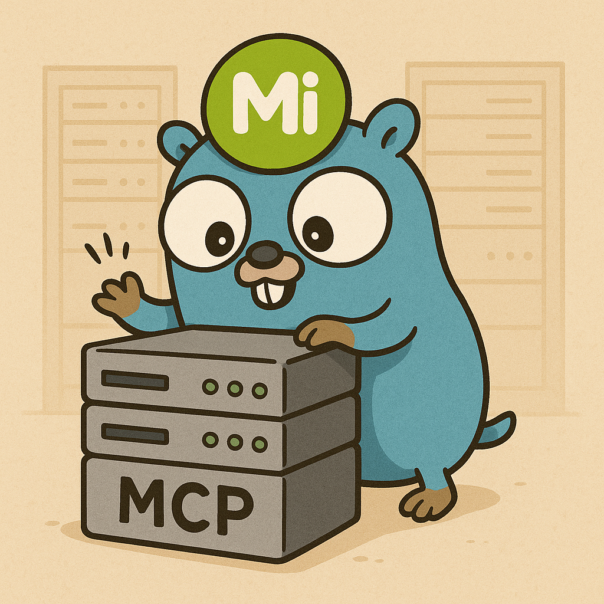

<div align="center">
    
</div>
<br/>
<div align="center">


[](https://pkg.go.dev/github.com/ganyariya/misskey-mcp-server)
[](https://goreportcard.com/report/github.com/ganyariya/misskey-mcp-server)

</div>

# misskey-mcp-server

misskey-mcp-server is an **unofficial** MCP (Model Context Protocol) server for [Misskey](https://misskey-hub.net/ja/).   
Currently, it only has **the bare minimum functionality: posting notes**.   
So, I would appreciate contributions (PRs) from everyone!

## Features

- [ ] [notes](https://misskey.io/api-doc#tag/notes)
  - [x] create (post) a note
- [ ] other wip...

## Usage

### Install

From go install

```shell
GOBIN="$HOME/go/bin" go install github.com/ganyariya/misskey-mcp-server/cmd/misskey-mcp-server@latest
```

Build your own

```shell
git clone https://github.com/ganyariya/misskey-mcp-server
cd misskey-mcp-server
go build -o misskey-mcp-server cmd/misskey-mcp-server/main.go
```

### Setup

Setup your mcp.json as below.

```json
{
  "mcpServers": {
    "misskey-mcp-server": {
      "command": "misskey-mcp-server",
      "args": [],
      "env": {
        // https://misskey-hub.net/ja/docs/for-developers/api/token/
        "MISSKEY_API_TOKEN": "aaaaaaaaaaaaaaaaaaaaaaaaaaaaaaaaaa",
        // http or https
        "MISSKEY_PROTOCOL": "https",
        // your misskey server's domain
        "MISSKEY_DOMAIN": "misskey.io", 
        "MISSKEY_PATH": ""
      },
      "disabled": false,
      "autoApprove": []
    }
  }
}
```

# TODO

I'm not very familiar with Go myself.   
I would appreciate contributions (PRs) from everyone!

I will prioritize implementing the fetching/updating of timelines, notes, and users.   
Regarding administrator privileges, perhaps it's safer not to implement them...?

- [ ] Vibe Coding Support
  - [ ] Create cline rules
  - [ ] Create cursor rules
- [ ] CI by GitHub Actions
- [ ] Release by goreleaser
- [ ] Refine Go Architecture
- [ ] Implement go tests
- [ ] Add docker-compose for development and mcp.json
- [ ] Implement each api tool
  - [ ] note
  - [ ] user
  - [ ] gallery
  - [ ] reaction
  - [ ] page
  - [ ] antenna
  - [ ] channel
  - [ ] federation
  - [ ] drive
  - [ ] notification

# Thanks to reference

- MCP Go Implementation
  - https://github.com/metoro-io/mcp-golang
- MCP Server References
  - https://github.com/metoro-io/metoro-mcp-server
  - https://github.com/grafana/mcp-grafana
- Misskey Go API SDK
  - https://github.com/yitsushi/go-misskey
